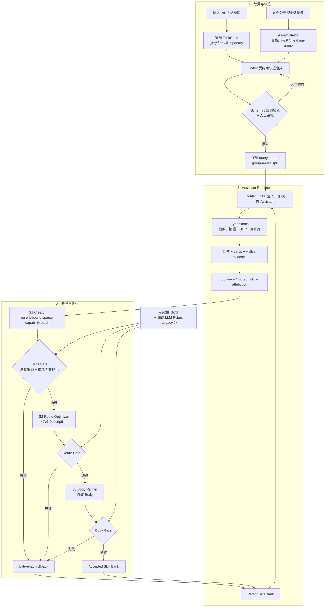

# E-SkillChain

> 面向电商视觉 AI 助手的分层 Skill 自进化框架<br>
> Hierarchical Skill Evolution for Image-based E-commerce Assistants

E-SkillChain（仓库名 ECommerceSkillChain）是一个面向 Agent / 算法工程求职展示的公开数据机制级复现项目。项目从论文 [SkillChain: Closing the Loop on Skill Evolution for Image-Based E-Commerce AI Assistants](https://arxiv.org/abs/2606.12984) 的五类意图出发，将 8 个公开视觉数据源组织为 6 项可执行能力；在冻结的 TaskSpec 与可验证资产上借助 Codex 合成交互轨迹并完成人工审批，再让 Creator、Route Optimizer 与 Body Refiner 从真实工具执行的失败中迭代 Skill Bank。

项目的核心不是“让模型自己改 Prompt”，而是把每次修改变成一个**有输入证据、有字段边界、有统一评测、可接受也可精确回滚**的工程闭环。

> **当前状态：model-generated runtime 的 30 轮双策略 S1 已完成；R12 的 Style action-policy 仍是唯一通过正式 replay/body gate 的候选，selected Bank 为 `e70ed907…096cd`。新的自适应周期首批 R34–R38 已结束并完整保留 R12：R34、R35、R36、R38 分别在 Feedback 标签、runtime dispatch、Creator 单句合同和 protected-target 可行性处 fail closed，不能解释为算法正负结果；只有 R37 进入有效局部 action screen，得到 4 gains / 10 regressions 并被固定有界风险门拒绝。五轮均未进入正式 replay200/body75，未访问 test300/S2/S3/Judge，也没有放宽 gate。首批可追踪 DashScope 成本为 ¥0.3496057，4 次 Creator 会话的人民币 cost basis 不可得。**

[V1 结果报告（HTML）](docs/portfolio-v1-results.html) · [S1 实验日志（HTML）](docs/s1-experiment-log.html) · [数据集设计报告（HTML）](docs/e-skillchain-dataset-design-interview-report.html) · [评测协议](docs/evaluation-protocol.md) · [复现契约](docs/reproduction-contract.md)

> GitHub 默认展示 HTML 源码；HTML 报告与实验日志建议下载后用浏览器打开。

## Core 1,500 默认实验入口

Core r3 完整实验现在使用独立的最小治理入口：

```powershell
uv run python scripts/run_core_experiment.py validate
```

当前 tracked spec 已把 `assistant_contract` 绑定为
`core-fast-model-generated-action-response-v1`，并绑定 fresh Static opt800 SHA
`a9949cd673fff547…2c0805a7` 与重新选择的 fixed samples。`validate --inputs-only` 和完整
`validate` 均通过；历史 deterministic R10 仍在独立 root 中保持只读，不能作为新 runtime 的
parent 或 resume 输入。

当前 runner 在冻结 Description 完成路由后，把所选 Skill 的 Body 与允许的函数工具交给 action model。
模型负责工具选择、参数和最终回答文本；runner 只负责真实工具执行、格式预检与最多一次固定修复，
不再用纯函数编译 DTO/card/evidence/fallback，也不再解析或渲染 typed semantic policy。S1 因而重新
拥有真实可消费的 Body treatment surface，同时继续冻结 Description、工具集合与工具顺序。

新的 S1 继续采用六个独立 Codex Creator 会话的 fan-out/fan-in；每个 capability 的一次结构化提案
同时包含可独立 `inherit|patch` 的 `action-policy` 与 `response-policy`。action-policy screen 固定
Static route、重新执行 action/tool loop，只评价 tool-first、公共参数、继续/重试与停止条件；
response-policy screen 固定 route/tool/scorer evidence，只评价 evidence、cards、answer、uncertainty 与
fallback。action 成功只看 `route_acceptable ∧ tool_contract_pass`；response 成功只看
`no_hard_error ∧ evidence_grounded ∧ output_contract_pass`。两类 patch 使用两组独立的
protected-success，分别通过后才在 capability 内组合，再参加
跨能力 fan-in。每个 surface 至少取得 1 个 gain、净增至少 1、regression 不超过 2 且 gain 至少为
regression 的 4 倍时才保留；普通失败之间的 reason 迁移只记录诊断，普通失败升级为 hard/runtime
failure 或对应固定边界漂移仍会硬拒绝。最终组合 Bank 还要完整重跑 replay200，并只在通过后访问一次
body_gate75；新 lineage 的 replay/body 单能力 floor 均为 `−5pp`。完整 fan-in replay 恢复模型自主
route/action/tool/answer，用来检验两类 policy 组合后的交互风险。

历史 deterministic v5/v6 的 10 轮终态为：R1–R3、R7、R9 在 Feedback terminal gate 前停止；R4 暴露并修复了错误 replay
primitive；R6 的 Document 分支局部通过但 body 增益为 0；R5、R8、R10 接受。R8 与 R10 的
Document Skill SHA 都是 `ec6ae462…6fdf`，R10 使用更小的 48-row contrastive packet、48/48
schema-valid Feedback，并以更低成本复现同一效果，所以被保留为后续阶段的**历史备选起点**。
删除 deterministic runtime 后这些数值不追溯重判，也不能外推到当前 model-generated runtime；
完整逐轮证据与本次架构更正见 [S1 实验日志](docs/s1-experiment-log.html)。

当前 model-generated lineage 的 fresh Static 为 168/800 GCS success、135/800 hard error，成本
¥1.2151480；no-op qualification 在 137 条 treatment-reached replay 上为 1 gain / 0 regression，
成本 ¥0.2627260。新的 30 轮 dual-policy campaign 共使用可追踪 DashScope ¥33.1941053；Creator
人民币 cost basis 不可得。每轮都从同一 Static parent 独立派生，不把 accepted 或 rejected 候选
作为后续 parent。R12 是唯一 `accepted=true` 的 Bank；R17/R26 虽有更高 body 增益和 Multi+Recipe
覆盖，但因 hard-error 超限回滚；R29 覆盖 Multi+Style 且 hard-error delta=0，body macro 仅
`+1.6667pp`，低于正式门。完整逐轮结果与 balanced top 10 见
[S1 实验日志](docs/s1-experiment-log.html)。

第一批证据根为 `E:\skillchain-data\runs\portfolio-core-qwen37-20260812-v2`，第二批为
`E:\skillchain-data\runs\portfolio-core-qwen37-20260812-v3`。十个 round root 均冻结
`accepted=false`；它们只用于审计。新的 fan-out 10 轮证据根为
`D:\athena\experiment-runs\portfolio-core-qwen37-fanout-v5-20260813` 与
`D:\athena\experiment-runs\portfolio-core-qwen37-fanout-v6-20260813`；除最终 R10 外不得任选失败候选继续 S2。
当前 model-generated Static 与 qualification 的证据根为
`D:\athena\experiment-runs\portfolio-core-qwen37-model-generated-v1-20260813`；30 轮 campaign
证据根为 `D:\athena\experiment-runs\portfolio-core-dual-policy-campaign-20260814` 与
`...-v2`。canonical top 10 为 R12/R17/R26/R29/R30/R4/R9/R13/R14/R21，其中只有 R12
标记为 deployable；其余 rejected candidate 不得进入 S2。

本次机制周期没有延续 R17/R26/R29 或其他 rejected Bank。它新增显式 `S1ParentBinding`，把
R12 Bank、accepted decision、来源 manifest、fresh R12 opt800 observations 及其 SHA 一起绑定；
Feedback selection、failure cluster、parent-success、replay baseline 与 Style 保护集全部改读同一
R12 parent lineage。R31/R32 的设计在任何 Feedback/Creator 调用前同时冻结，每轮只有一个
capability 的一个 surface 可修改，Creator 只能输出一条
`If and only if <when>, <then>. Otherwise preserve ...` 条件规则。局部有界风险 screen 后仍必须依次
通过 replay200 与 body75；只有正式 accepted branch 才能进入 R33。body75 不再用于调整下一轮机制，
test300 只允许对一个已冻结 finalist 成对运行一次。本周期没有 finalist，命令已 fail closed，
因此 test300 仍 untouched，也没有改变五配置最终评测边界。

fresh R12 parent opt800 的 canonical 成功 lineage 位于
`D:\athena\experiment-runs\portfolio-core-r12-counterfactual-v3-20260814`：800/800、GCS success
164、hard error 146、observation SHA `4c6bafa65e320f46…aa84fcf`，成本 ¥1.2439722。此前 v2
lineage 为 799 success + 1 non-retryable provider failure，已知成本 ¥1.2357178，另有失败请求
orphan 成本未知；它未参与 selection。终态 R31/R32/R33 位于 `...-v4-20260814`，R31 的 9 条
Qwen3.8 Feedback 成本 ¥0.04388745，唯一 Creator 为 `35,972 / 823` input/output tokens、人民币
cost basis 不可得。周期可追踪总成本 ¥2.52357745，Assistant replay/body 与 test 均为 0-call。

本周期的结果只能表述为 **treatment throughput 0/2**，不能写成 S1 增益或负增益。下一版
`single-surface-counterfactual-fanout-v5` 将 action Creator 限制为枚举化的 tool-loop state 与单一
transition，schema 中不再存在 response `when/then` 文本通道；Feedback 必须带且只带目标
`[action-policy]` 或 `[response-policy]` 标签。response selector 先要求 route 正确、tool contract
通过、无 hard error、成功 tool trace 可固定，再按 tool/evidence 类型和 empty/nonempty 分支聚类，
不再用精确 card 数量制造伪稀缺。任何新 Feedback 前，所有预注册轮次必须一次性通过 3/3/3
evidence-feasibility 与离线 treatment-sensitivity preflight；一项失败即阻止整个周期。R12 仍是唯一
parent，R33 accepted-only fan-in 与 one-finalist test300 规则不变。

自适应周期首批 `s1-r12-adaptive-v1-b01` 预注册 R34–R38，全部继续以 R12 为唯一 parent。R34
暴露 Feedback disposition/surface 双标签冲突；R35 暴露局部 screen 的描述性 `s1-*` config 未映射到
S1 runtime；R36 证明 response Creator 的单句限制必须进入 JSON Schema；R37 是本批唯一可解释的
局部 treatment，Encyclopedia action 为 4 gains / 10 regressions，并破坏 2/3 显式 parent-success，
按冻结门回滚；R38 则暴露“Style 同时是 target 和 byte-exact protected Skill”的预注册矛盾，0 Assistant
即停。相应机制修正仅前向生效：Suggestion 强制 disposition + surface 标签、所有动态 `s1-*` label
归一到 S1 runtime、response 字段禁止多句 checklist、`must_preserve` 实例只留在 verifier，以及
all-round preflight 新增 protected-target compatibility。没有候选进入正式 replay200/body75，R12
selected Bank 与 R33/test300 规则不变；逐轮事实见 [S1 实验日志](docs/s1-experiment-log.html)。

新 Fast Path 的实测容量配置为：Assistant `qwen3.7-flash-2026-07-15` 并发上限 `60`，
每次真实 HTTP 调用按 `20 requests/s` 平滑启动；Qwen3.8 Feedback worker 上限 `60`、`8 requests/s`，当前
采用 `canary6 + remaining42/54` 的 48 或 60 条 Feedback。完整集合必须在
Creator 前通过 completeness、service-error 与 parse/schema-error 门。限速作用于每次 provider call，而不是外层
query。该配置只用于新 Fast execution overlay；历史 Formal profile、配置和 receipt
保持原样，不回写。

完整入口固定执行 `dev200 → opt800 → val200 → test300`，生成五配置 `val=1,000`、
`test=1,500` 条逻辑结果；回滚配置复用 parent 的精确结果。历史 Formal Core 治理入口仍
保留兼容，但不再是 Core Portfolio Quickstart 的默认依赖。详见
[Core 1,500 Fast Path](docs/core-fast-path.md) 和
[唯一增益执行计划](docs/plans/2026-08-06-core-1500-interview-gain-execution-plan.md)。

## 为什么做这个项目

图像电商助手面对的不是一种任务：同一张图片可能触发商品同款检索、多商品识别、穿搭推荐、视觉百科、票据读取或食谱指导。它们需要不同的路由、工具、证据和输出卡片，单一系统提示词很容易在能力之间产生干扰。

原论文依赖生产流量、内部商品数据、专有工具和专家反馈，这些条件无法在公开环境中等价复现。本项目因此选择“机制级复现”：

- 用公开数据重建真实任务语义，而不冒充企业生产流量；
- 用可执行 TaskSpec、typed tools 和输出契约代替隐含业务规则；
- 用受约束的 Skill 演化代替不可追踪的 Prompt 改写；
- 用确定性评分器与冻结 LLM Rubric 互补评测；
- 同时保留成功、失败、成本与回滚证据。

## 系统全景



## 核心设计

### 1. 监督信号优先的数据构造

数据源不是按“看起来像电商”粗粒度堆叠，而是先为每项 capability 定义可执行成功条件，再寻找能够提供相应监督信号的数据。论文中的 Utility 意图被进一步拆成文档读取与食谱指导，因此形成 5 个顶层意图、6 项 MVP capability。

| 论文意图 | 项目 capability | 主要公开数据 | 需要验证的行为 |
| --- | --- | --- | --- |
| Visual Encyclopedia | `knowledge.visual_encyclopedia` | iNaturalist、Wikimedia / Wikipedia KB | 识别对象、检索知识、给出可追溯证据 |
| Exact Product Search | `product.exact_match` | Amazon Berkeley Objects（ABO） | 用不同真实视图检索同一商品并校准不确定性 |
| Multi-product Search | `product.multi_search` | RPC | 分解图中多个商品并分别返回商品卡 |
| Divergent Recommendation | `product.style_recommendation` | FashionIQ、ABO | 结合图像和文本条件返回有差异的风格候选 |
| Utility | `utility.document_reading` | CORD、SROIE、Wikimedia Documents | OCR、结构化抽取并引用可见文字 |
| Utility | `utility.recipe_guidance` | ISIA Food-500、recipe KB | 识别食物并基于知识库给出步骤与约束 |

TaskSpec、AssetCatalog 和 Query schema 共同约束 Codex：只能引用已登记资产，必须满足 capability 分布、单/多轮比例、boundary 类型和结构化字段要求。合成结果先进入 staging，而不是直接进入实验集。

人工门控采用两种强度，并在报告中明确区分：

- `dev_mini`：8 批 × 25 条逐批审批；有 4 个初稿被原样拒绝并修订，终态 200 条全部接受。
- Core r3：先对 60 批 × 25 条执行机械门控，再做 cluster-aware owner audit 和定向修复；它不是“1,500 条全部人工标注”。终态语料为 1,500 条 query / 2,400 turns。

| 冻结数据资产 | 规模 | 作用 |
| --- | ---: | --- |
| AssetCatalog | 1,022 assets / 872 leakage components / 1,120 capability bindings | 统一资产身份、来源、资格和分组 |
| `dev_mini` | 200 queries，含 40 条 boundary | V1 五配置开发诊断与闭环验证 |
| Core r3 corpus | 1,500 queries / 2,400 turns / 867 leakage components | 200 / 800 / 200 / 300 的 dev、opt、val、test 扩展轨 |

更完整的选源逻辑、Codex 提示约束、批次审批与修复记录见[数据集设计报告](docs/e-skillchain-dataset-design-interview-report.html)。

### 2. 字段隔离的分层 Skill 演化

Skill 被拆成影响路由的 Description 与影响执行的 Body。每个阶段只接收它需要的反馈并限制可修改字段，降低多个目标同时变化造成的归因混乱。

| 阶段 | 主要输入 | 允许的变化 | 接受条件 | V1 状态 |
| --- | --- | --- | --- | --- |
| S1 Creator | 失败轨迹、failure attribution、锚点样本、Parent Bank | 六能力 fan-out Body patch；每项再拆 action / response surface，未改项 byte-exact inherit | 两类 surface 独立 screen、capability 内组合、六能力 fan-in replay 后一次正式 GCS 接受门 | fresh Static 与 30 轮完成；R12 Style action-policy accepted，覆盖 `1/6` |
| S2 Route Optimizer | 路由混淆、误路由样本、当前 Bank | **Description-only** | 路由指标提升且 Body SHA 不变 | 可执行原型；若推进只允许从 R12 canonical Bank 开始，本阶段未启动 |
| S3 Body Refiner | 内容、工具、证据和卡片失败 | **Body-only** | 端到端质量提升且路由字段不变 | 可执行原型；等待后续阶段决定是否从 R12 推进 |

候选 Bank 保存 parent / candidate lineage 与内容哈希。Gate 失败时，系统恢复到逐字节一致的 Parent Bank，而不是在失败候选上继续“补丁式调参”。

### 3. 有证据约束的 Assistant Runtime

Runtime 将 capability 路由、Skill 注入、模型调用、typed tool registry、卡片渲染和证据投影分开。Assistant 只能通过冻结工具契约调用商品检索、组合检索、风格检索、对象检测、OCR 与知识库；最终评测只接收用户可见回答、cards 和净化后的 tool evidence，不接收配置名、Skill 身份或私有运行元数据。

主比较固定为五组配置：

| 配置 | Skill 来源 | 演化阶段 |
| --- | --- | --- |
| `NoSkill` | 不注入 Skill | 无 |
| `LLMStaticSkill` | 同一 AuthoringPacket 一次性生成的静态 Bank | 无轨迹反馈 |
| `S1` | Static + Creator | S1 |
| `S1+S2` | S1 + Route Optimizer | S1、S2 |
| `Full` | S1 + Route Optimizer + Body Refiner | S1、S2、S3 |

比较保持同一 query、顺序、Assistant backbone、工具、调用预算、评分规则和固定分母；`S1+S2` 与 `Full` 共享逐 query route，避免把路由采样噪声错误归因给 S3。

### 4. 确定性评分器 + 冻结 LLM Rubric

评测采用主次分明的双路机制，而不是把两个分数混成一个数字。

| 层级 | 指标 | 设计 |
| --- | --- | --- |
| Primary | Grounded Contract Success（GCS） | 每题同时满足 acceptable route、无 hard error、工具契约、证据落地、输出 / 卡片契约才记 1，否则记 0；headline 按 6 capability macro 汇总，同时报告 micro |
| Diagnostic | Route / error / compliance | Route macro-F1、混淆矩阵、McNemar、hard-error、evidence compliance、card compliance、token / cost / latency |
| Secondary | Legacy J | 冻结 LLM Judge 只返回 TCR、CCC、CQ、能力 / 工具行为适配四个整数维度；本地可信编译器计算 0–100 分、执行 card guard，parse / provider / timeout 失败保留在分母并按 0 |
| Semantic check | 盲化 pairwise / 人工评审 | 只在前置确定性 Gate 通过后运行；隐藏配置和 Skill 身份，允许 tie |

冻结 Core 主评测预注册按 leakage connected component 做 10,000 次配对 Bootstrap；本页已报告的 `evaluation175` 开发诊断使用 20,000 次。路由差异使用 McNemar。GCS 低方差、可重算并能定位契约失败，Legacy J 则补充自然语言完成度和内容质量，两者不可直接相加。

## Portfolio V1：真实结果

### 历史 R0：Failure-driven S1 闭环

本轮实际链路为：

```text
Static opt800 运行
→ 失败归因
→ 48 条 Qwen Feedback
→ Codex Creator 生成六能力候选 Bank
→ 200 条独立 replay
→ GCS Gate
→ Reject + byte-exact rollback
```

| 指标 | Static | S1 candidate | 变化 |
| --- | ---: | ---: | ---: |
| GCS capability-macro | 21.7729% | 25.2749% | **+3.5021pp** |
| GCS query-micro | 26.0% | 31.0% | **+5.0pp** |
| Visual Encyclopedia GCS | 7.5% | 2.5% | **−5.0pp** |
| Hard-error | — | — | 0pp |

候选在总体指标上有正向信号，但百科能力跌幅超过预先冻结的 `−3pp` 单能力底线，因此系统拒绝整 Bank 并回滚。这个结果验证的是“失败闭环与风险门控真实生效”，不代表 S1 已被接受或部署。

本轮 Qwen Feedback `48/48` 解析成功，Feedback 与 replay 共 715 次可计量 DashScope 调用，费用 CNY `1.1991934`；Codex Creator 会话单列，不虚构人民币 provider 成本。实际角色为 Assistant `qwen3-vl-flash-2026-01-22`、Feedback `qwen3.7-plus-2026-05-26`、Creator Codex `gpt-5.6-sol/high`；AIFast `gemini-3.6-flash` Final Judge 因前置 GCS Gate 失败而保持 0-call，body gate、val 与 test 也未启动。机器可读绑定见 [model-role-selection-v8](specs/authoring/model-role-selection-v8.json)。

### Core Fast Qwen3.7 R1–R5：sparse S1 终态

Static opt800 已用 `qwen3.7-flash-2026-07-15` fresh 重跑；R1 使用 12 份 fresh Qwen3.8
Feedback，R2–R5 逐字节复用同一 SHA-bound bundle，新增 Feedback provider call 为 0。

| Round | 唯一变化 | 最深证据 | 结果 | 本轮新增可计量费用 |
| --- | --- | --- | --- | ---: |
| R1 | Multi positive closure | smoke24 + replay200 | `8→9`，但有 4 条 paired regression；回滚 | Assistant CNY `0.3461880` |
| R2 | Multi tool-first + DTO closure | smoke24 + replay200 | `8→20`，但仍有 1 条 paired regression和 3 个新 contract occurrence；回滚 | Assistant CNY `0.3708244` |
| R3 | Multi DTO template | Creator boundary | sparse authored-content guard 拒绝候选；Assistant 0-call | Creator 费用不可得 |
| R4 | Document literal line copy | smoke24 + replay200 | `0→0` 且新增 3 个 contract occurrence；回滚 | Assistant CNY `0.3511126` |
| R5 | Style evidence copy | smoke24 + replay200 | `7→26`，但有 2 条 paired regression和 4 个新 occurrence；回滚 | Assistant CNY `0.3509304` |

R2 与 R5 都出现明显净改善，但预冻结 screen 对任何 Static-success→candidate-failure 或新
contract occurrence 都 fail closed，因此不能用净增益覆盖新引入的风险。R3 则是词法 guard
拒绝，DTO 假设并未得到 Assistant 实验，不能写成算法失败或无授权重试。最终 selected Bank
是 Static `da5cfe1f93f2cb57b389c97738034cf10cab931dcc30e145acc6d8873ff1348a`；本次可追踪
provider 记录为 7,823 calls、CNY `3.9202578`，另有废弃 Static v1 的一条未知 orphan；
5 次 Creator 的人民币成本不可得。`body_gate75`、Final Judge、S2、val 与 test 均未访问。

### 授权后的 Qwen3.7 R6–R10：第二批 sparse S1 终态

第二批先修复 R3 暴露的词法 guard 假阳性，并把脱敏的稳定拒绝 reason code 写入 decision；
随后继续复用同一 Static v2 与同一 SHA-bound Feedback，每轮仍只 patch 一个 capability。

| Round | 唯一变化 | Target replay success | Paired 回退 / 新 contract occurrence | 终态 |
| --- | --- | ---: | ---: | --- |
| R6 | Multi tool-first + exact public DTO copier | `8→18` | `2 / 4` | 回滚 |
| R7 | Style tool-first + evidence/fallback serializer | `7→22` | `2 / 4` | 回滚 |
| R8 | Recipe detect/lookup + source-only closure | `3→10` | `0 / 7` | 回滚 |
| R9 | Exact image/text input latch | `17→17` | `2 / 2` | 回滚 |
| R10 | Document literal OCR lines | `0→0` | `0 / 1` | 回滚 |

R8 最接近安全保留：没有任何 Static-success 回退，但在原失败样本上出现 7 个新的 contract
occurrence，因此仍按预注册 screen 回滚。第二批 Assistant 共 1,120 个 outer / 3,588 个真实
Qwen3.7 model calls，新增可计费用 CNY `1.8057772`；五次 Creator 均成功，但人民币 cost
basis 不可得。五轮都没有访问 `body_gate75`、S2、val 或 test。

> GCS 是五项条件全通过才记 1 的严格二元指标，绝对值不能按传统连续质量分直接解读。

### 五配置开发诊断

以下是 `dev_mini` 中未参与 gate 的 175 条 evaluation query 上的 Legacy J，属于开发诊断，不是 Core `test300` 最终结论：

| 配置 | Mean Legacy J | 相较 NoSkill | 相较 Static |
| --- | ---: | ---: | ---: |
| NoSkill | 68.706 | — | — |
| LLMStaticSkill | 69.937 | +1.231 | — |
| S1 | 71.131 | +2.425 | +1.194 |
| S1+S2 | **72.080** | **+3.374** | **+2.143** |
| Full | 70.940 | +2.234 | +1.003 |

`S1+S2 − Static` 的 leakage-group 配对 Bootstrap 95% CI 为 `[-1.111, 5.422]`，跨越 0，因此这里只能称为方向性信号。同期路由准确率从 80.0% 提升到 92.0%，card compliance 从 81.7% 提升到 90.3%。这些数字与上面的 GCS replay 属于不同证据轨，不能相加。

完整结果、成本、失败分析和证据索引见 [Portfolio V1 结果报告](docs/portfolio-v1-results.html)。

## 快速开始

### 环境

- Python 3.12
- [uv](https://docs.astral.sh/uv/)

```bash
uv sync --frozen --dev
```

### 运行默认离线测试

```bash
# 与 GitHub Actions 一致的快速验证
uv run pytest tests/test_offline_engineering_fixture.py -q

# 完整的非 integration 测试；项目配置会默认排除真实外部服务
uv run pytest
```

### 从空目录重建离线工程 Fixture

```bash
# --output 必须指向尚不存在的目录
uv run skillchain-offline-fixture --output runs/offline-fixture-001
```

该入口会离线重建一组最小 query、AssetCatalog、split、typed tools、五配置 bundle 和评测隔离产物，并输出 artifact-tree hash。它用于验证工程结构，不代表真实模型效果或 formal 结果。

真实模型实验是显式 opt-in：先将 `.env.example` 复制为 `.env` 并填写自己的凭据，再按对应 runbook 执行。它会访问外部服务并产生费用。配置模块可能加载本地 `.env`，但默认 `pytest` profile 会排除 integration 测试，不会使用凭据发起模型调用；测试进程的 Python socket guard 还会阻断 DNS / connect。该 guard 不是 OS 级网络沙箱。

## 仓库地图

| 路径 | 内容 |
| --- | --- |
| [`src/skillchain/data`](src/skillchain/data) | 数据适配、AssetCatalog、来源与 leakage 管理 |
| [`src/skillchain/synthesis`](src/skillchain/synthesis) | seed、批次、Codex 合成、审批与 group-aware split |
| [`src/skillchain/runners`](src/skillchain/runners) | Assistant / Authoring runtime 与网络边界 |
| [`src/skillchain/tools`](src/skillchain/tools) | typed tool contracts、registry、检索、检测、OCR 与 KB |
| [`src/skillchain/evolution`](src/skillchain/evolution) | attribution、S1 Gate、Route Optimizer、Body Refiner |
| [`src/skillchain/evaluation`](src/skillchain/evaluation) | GCS、Legacy J、blind packets、矩阵执行与结果汇总 |
| [`specs`](specs) | taxonomy、TaskSpec、数据、模型与评测冻结契约 |
| [`scripts`](scripts) | 数据准备、运行、监控、审计和分析入口 |
| [`tests`](tests) | 默认离线测试与显式 integration 测试 |
| [`docs`](docs) | 设计报告、协议、runbook、实验计划和 backlog |

## 文档导航

- [Portfolio V1 结果报告](docs/portfolio-v1-results.html)：当前最完整的实验结果、成本与失败分析。
- [数据集设计报告](docs/e-skillchain-dataset-design-interview-report.html)：从论文意图到公开数据、Codex 轨迹合成与人工审批。
- [评测协议](docs/evaluation-protocol.md)：五配置公平性、GCS、Legacy J、Bootstrap 与失败处理。
- [复现契约](docs/reproduction-contract.md)：Portfolio / Formal 两条轨道与声明边界。
- [数据下载 Runbook](docs/data-download-runbook.md) 与 [Mock 轨迹 Runbook](docs/mock-trajectory-runbook.md)：本地数据准备流程。
- [项目 Backlog](docs/project-backlog.md)：不阻塞 V1 的后续工作。
- [冻结 Taxonomy](specs/taxonomy/ecommerce-mvp-taxonomy-v0.json)、[TaskSpec](specs/task_specs/ecommerce-task-spec-v1.json)、[GCS v2](specs/evaluation/portfolio-gcs-v2.json) 与 [Legacy J Rubric](specs/evaluation/portfolio-final-rubric-v1.json)：机器可读设计。
- [模型角色 v8](specs/authoring/model-role-selection-v8.json)：当前 Assistant、Feedback、Creator 与 Final Judge 的冻结身份。

## 可复现性与声明边界

- 本项目复现的是 SkillChain 的**机制**，不是论文作者的官方实现，也不声称复现其生产流量、内部数据、专有工具、专家团队、线上 A/B 或绝对分数。
- 所有合成 query 均标记为 `synthetic_derived`；它们模拟任务结构，不代表真实用户分布。
- 原始图像、大体量数据、私有授权材料、API key 和大多数真实 run artifact 不随 Git 仓库分发。仓库公开代码、冻结规格、离线 fixture、选定证据与汇总报告。
- Core r3 语料已经构造，但冻结的 `test300` 尚未执行；README 不把 development 诊断写成最终总体增益。
- 历史 deterministic fan-out R10 是旧 runtime 下的 Document 单能力备选，不是当前 model-generated runtime 的有效 parent。当前 runtime 的 30 轮 S1 中只有 R12 accepted；balanced top 10 的其他九项均是不可部署研究证据。新的 R31/R32/R33 周期只能从 R12 fresh parent observations 前向派生。S2 / S3 / Judge / test 均未启动。
- 部分历史 authoring receipt / runbook 保留创建时的 Windows 本地路径，它们是不可改写实验记录，不是 Quickstart 的可移植依赖。

## 数据与许可证

本项目原创代码与项目文档采用 [Apache License 2.0](LICENSE)，Copyright 2026 Wenxi Ma。

第三方数据、图片、模型与论文各自遵循其原始许可证和使用条款，不包含在本项目 Apache-2.0 授权范围内。公开仓库不分发原始数据资产或论文 PDF；数据源口径见 [data authorization tracking](docs/data-authorization-tracking.csv) 与各 source spec。论文仅通过官方 [arXiv 页面](https://arxiv.org/abs/2606.12984)引用。

## 下一步

1. 保持历史 deterministic rounds、当前 30 轮 canonical artifacts 及所有 rejected Bank 只读，不追溯重判，也不跨 runtime resume。
2. 后续阶段唯一合法 S1 起点是 accepted R12 Bank `e70ed907…096cd`；top 10 的其余九项只用于算法诊断。
3. `s1-counterfactual-v1` 已结束且没有 finalist：保持 R12 selected Bank，不追认 R31 Creator 输出，不放宽 R32 parent-success 匹配，也不访问 test300。
4. 每个后续 batch 必须在任何 Feedback 前一次性通过 evidence-feasibility、treatment-sensitivity 与 protected-target compatibility；不能把 R12 Style 同时声明为 byte-exact protected Skill 和可修改 target。
5. 下一批仍从 R12 出发，并只使用前向修正后的双标签 Feedback、typed action IR、单句 response contract 与 verifier-only protection examples；R34–R38 的失败候选不得作为 parent 或被拼入 fan-in。
6. 局部有界风险门、正式 replay/body 门与 R33/test300 规则保持冻结；在候选通过正式 replay200/body75 前，不访问 test300，也不启动 S2/S3/Judge。

---

如果你是第一次阅读本项目，建议按 **README → 数据集设计报告 → V1 结果报告 → 评测协议** 的顺序了解；如果你要复现工程，先运行离线 fixture，再按数据与实验 runbook 准备真实环境。
