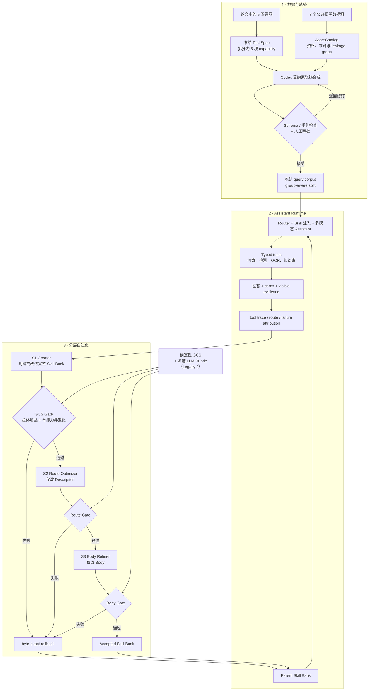

# E-SkillChain

> 面向电商视觉 AI 助手的分层 Skill 自进化框架<br>
> Hierarchical Skill Evolution for Image-based E-commerce Assistants

E-SkillChain（仓库名 ECommerceSkillChain）是一个面向 Agent / 算法工程求职展示的公开数据机制级复现项目。项目从论文 [SkillChain: Closing the Loop on Skill Evolution for Image-Based E-Commerce AI Assistants](https://arxiv.org/abs/2606.12984) 的五类意图出发，将 8 个公开视觉数据源组织为 6 项可执行能力；在冻结的 TaskSpec 与可验证资产上借助 Codex 合成交互轨迹并完成人工审批，再让 Creator、Route Optimizer 与 Body Refiner 从真实工具执行的失败中迭代 Skill Bank。

项目的核心不是“让模型自己改 Prompt”，而是把每次修改变成一个**有输入证据、有字段边界、有统一评测、可接受也可精确回滚**的工程闭环。

> **当前状态：Portfolio V1 已完成五配置 `dev_mini 200×5` 方向性比较和一次真实 failure-driven S1 闭环；S1 候选总体 GCS 上升，但视觉百科退化触发非退化门，因此候选已被拒绝并 byte-exact 回滚。Core `test300` 尚未运行。**

[V1 结果报告（HTML）](docs/portfolio-v1-results.html) · [数据集设计报告（HTML）](docs/e-skillchain-dataset-design-interview-report.html) · [评测协议](docs/evaluation-protocol.md) · [复现契约](docs/reproduction-contract.md)

> GitHub 默认展示 HTML 源码；两份 HTML 报告建议下载后用浏览器打开。

## 为什么做这个项目

图像电商助手面对的不是一种任务：同一张图片可能触发商品同款检索、多商品识别、穿搭推荐、视觉百科、票据读取或食谱指导。它们需要不同的路由、工具、证据和输出卡片，单一系统提示词很容易在能力之间产生干扰。

原论文依赖生产流量、内部商品数据、专有工具和专家反馈，这些条件无法在公开环境中等价复现。本项目因此选择“机制级复现”：

- 用公开数据重建真实任务语义，而不冒充企业生产流量；
- 用可执行 TaskSpec、typed tools 和输出契约代替隐含业务规则；
- 用受约束的 Skill 演化代替不可追踪的 Prompt 改写；
- 用确定性评分器与冻结 LLM Rubric 互补评测；
- 同时保留成功、失败、成本与回滚证据。

## 系统全景



## 核心设计

### 1. 监督信号优先的数据构造

数据源不是按“看起来像电商”粗粒度堆叠，而是先为每项 capability 定义可执行成功条件，再寻找能够提供相应监督信号的数据。论文中的 Utility 意图被进一步拆成文档读取与食谱指导，因此形成 5 个顶层意图、6 项 MVP capability。

| 论文意图 | 项目 capability | 主要公开数据 | 需要验证的行为 |
| --- | --- | --- | --- |
| Visual Encyclopedia | `knowledge.visual_encyclopedia` | iNaturalist、Wikimedia / Wikipedia KB | 识别对象、检索知识、给出可追溯证据 |
| Exact Product Search | `product.exact_match` | Amazon Berkeley Objects（ABO） | 用不同真实视图检索同一商品并校准不确定性 |
| Multi-product Search | `product.multi_search` | RPC | 分解图中多个商品并分别返回商品卡 |
| Divergent Recommendation | `product.style_recommendation` | FashionIQ、ABO | 结合图像和文本条件返回有差异的风格候选 |
| Utility | `utility.document_reading` | CORD、SROIE、Wikimedia Documents | OCR、结构化抽取并引用可见文字 |
| Utility | `utility.recipe_guidance` | ISIA Food-500、recipe KB | 识别食物并基于知识库给出步骤与约束 |

TaskSpec、AssetCatalog 和 Query schema 共同约束 Codex：只能引用已登记资产，必须满足 capability 分布、单/多轮比例、boundary 类型和结构化字段要求。合成结果先进入 staging，而不是直接进入实验集。

人工门控采用两种强度，并在报告中明确区分：

- `dev_mini`：8 批 × 25 条逐批审批；有 4 个初稿被原样拒绝并修订，终态 200 条全部接受。
- Core r3：先对 60 批 × 25 条执行机械门控，再做 cluster-aware owner audit 和定向修复；它不是“1,500 条全部人工标注”。终态语料为 1,500 条 query / 2,400 turns。

| 冻结数据资产 | 规模 | 作用 |
| --- | ---: | --- |
| AssetCatalog | 1,022 assets / 872 leakage components / 1,120 capability bindings | 统一资产身份、来源、资格和分组 |
| `dev_mini` | 200 queries，含 40 条 boundary | V1 五配置开发诊断与闭环验证 |
| Core r3 corpus | 1,500 queries / 2,400 turns / 867 leakage components | 200 / 800 / 200 / 300 的 dev、opt、val、test 扩展轨 |

更完整的选源逻辑、Codex 提示约束、批次审批与修复记录见[数据集设计报告](docs/e-skillchain-dataset-design-interview-report.html)。

### 2. 字段隔离的分层 Skill 演化

Skill 被拆成影响路由的 Description 与影响执行的 Body。每个阶段只接收它需要的反馈并限制可修改字段，降低多个目标同时变化造成的归因混乱。

| 阶段 | 主要输入 | 允许的变化 | 接受条件 | V1 状态 |
| --- | --- | --- | --- | --- |
| S1 Creator | 失败轨迹、failure attribution、锚点样本、Parent Bank | 创建或改进完整六能力 Bank | GCS 总体增益、hard-error 非劣、单能力不过底线 | 已真实运行；候选被 Gate 拒绝并回滚 |
| S2 Route Optimizer | 路由混淆、误路由样本、当前 Bank | **Description-only** | 路由指标提升且 Body SHA 不变 | 可执行原型；本轮因 S1 失败未进入下游 |
| S3 Body Refiner | 内容、工具、证据和卡片失败 | **Body-only** | 端到端质量提升且路由字段不变 | 可执行原型；本轮因 S1 失败未进入下游 |

候选 Bank 保存 parent / candidate lineage 与内容哈希。Gate 失败时，系统恢复到逐字节一致的 Parent Bank，而不是在失败候选上继续“补丁式调参”。

### 3. 有证据约束的 Assistant Runtime

Runtime 将 capability 路由、Skill 注入、模型调用、typed tool registry、卡片渲染和证据投影分开。Assistant 只能通过冻结工具契约调用商品检索、组合检索、风格检索、对象检测、OCR 与知识库；最终评测只接收用户可见回答、cards 和净化后的 tool evidence，不接收配置名、Skill 身份或私有运行元数据。

主比较固定为五组配置：

| 配置 | Skill 来源 | 演化阶段 |
| --- | --- | --- |
| `NoSkill` | 不注入 Skill | 无 |
| `LLMStaticSkill` | 同一 AuthoringPacket 一次性生成的静态 Bank | 无轨迹反馈 |
| `S1` | Static + Creator | S1 |
| `S1+S2` | S1 + Route Optimizer | S1、S2 |
| `Full` | S1 + Route Optimizer + Body Refiner | S1、S2、S3 |

比较保持同一 query、顺序、Assistant backbone、工具、调用预算、评分规则和固定分母；`S1+S2` 与 `Full` 共享逐 query route，避免把路由采样噪声错误归因给 S3。

### 4. 确定性评分器 + 冻结 LLM Rubric

评测采用主次分明的双路机制，而不是把两个分数混成一个数字。

| 层级 | 指标 | 设计 |
| --- | --- | --- |
| Primary | Grounded Contract Success（GCS） | 每题同时满足 acceptable route、无 hard error、工具契约、证据落地、输出 / 卡片契约才记 1，否则记 0；headline 按 6 capability macro 汇总，同时报告 micro |
| Diagnostic | Route / error / compliance | Route macro-F1、混淆矩阵、McNemar、hard-error、evidence compliance、card compliance、token / cost / latency |
| Secondary | Legacy J | 冻结 LLM Judge 只返回 TCR、CCC、CQ、能力 / 工具行为适配四个整数维度；本地可信编译器计算 0–100 分、执行 card guard，parse / provider / timeout 失败保留在分母并按 0 |
| Semantic check | 盲化 pairwise / 人工评审 | 只在前置确定性 Gate 通过后运行；隐藏配置和 Skill 身份，允许 tie |

冻结 Core 主评测预注册按 leakage connected component 做 10,000 次配对 Bootstrap；本页已报告的 `evaluation175` 开发诊断使用 20,000 次。路由差异使用 McNemar。GCS 低方差、可重算并能定位契约失败，Legacy J 则补充自然语言完成度和内容质量，两者不可直接相加。

## Portfolio V1：真实结果

### Failure-driven S1 闭环

本轮实际链路为：

```text
Static opt800 运行
→ 失败归因
→ 48 条 Qwen Feedback
→ Codex Creator 生成六能力候选 Bank
→ 200 条独立 replay
→ GCS Gate
→ Reject + byte-exact rollback
```

| 指标 | Static | S1 candidate | 变化 |
| --- | ---: | ---: | ---: |
| GCS capability-macro | 21.7729% | 25.2749% | **+3.5021pp** |
| GCS query-micro | 26.0% | 31.0% | **+5.0pp** |
| Visual Encyclopedia GCS | 7.5% | 2.5% | **−5.0pp** |
| Hard-error | — | — | 0pp |

候选在总体指标上有正向信号，但百科能力跌幅超过预先冻结的 `−3pp` 单能力底线，因此系统拒绝整 Bank 并回滚。这个结果验证的是“失败闭环与风险门控真实生效”，不代表 S1 已被接受或部署。

本轮 Qwen Feedback `48/48` 解析成功，Feedback 与 replay 共 715 次可计量 DashScope 调用，费用 CNY `1.1991934`；Codex Creator 会话单列，不虚构人民币 provider 成本。实际角色为 Assistant `qwen3-vl-flash-2026-01-22`、Feedback `qwen3.7-plus-2026-05-26`、Creator Codex `gpt-5.6-sol/high`；AIFast `gemini-3.6-flash` Final Judge 因前置 GCS Gate 失败而保持 0-call，body gate、val 与 test 也未启动。机器可读绑定见 [model-role-selection-v8](specs/authoring/model-role-selection-v8.json)。

> GCS 是五项条件全通过才记 1 的严格二元指标，绝对值不能按传统连续质量分直接解读。

### 五配置开发诊断

以下是 `dev_mini` 中未参与 gate 的 175 条 evaluation query 上的 Legacy J，属于开发诊断，不是 Core `test300` 最终结论：

| 配置 | Mean Legacy J | 相较 NoSkill | 相较 Static |
| --- | ---: | ---: | ---: |
| NoSkill | 68.706 | — | — |
| LLMStaticSkill | 69.937 | +1.231 | — |
| S1 | 71.131 | +2.425 | +1.194 |
| S1+S2 | **72.080** | **+3.374** | **+2.143** |
| Full | 70.940 | +2.234 | +1.003 |

`S1+S2 − Static` 的 leakage-group 配对 Bootstrap 95% CI 为 `[-1.111, 5.422]`，跨越 0，因此这里只能称为方向性信号。同期路由准确率从 80.0% 提升到 92.0%，card compliance 从 81.7% 提升到 90.3%。这些数字与上面的 GCS replay 属于不同证据轨，不能相加。

完整结果、成本、失败分析和证据索引见 [Portfolio V1 结果报告](docs/portfolio-v1-results.html)。

## 快速开始

### 环境

- Python 3.12
- [uv](https://docs.astral.sh/uv/)

```bash
uv sync --frozen --dev
```

### 运行默认离线测试

```bash
# 与 GitHub Actions 一致的快速验证
uv run pytest tests/test_offline_engineering_fixture.py -q

# 完整的非 integration 测试；项目配置会默认排除真实外部服务
uv run pytest
```

### 从空目录重建离线工程 Fixture

```bash
# --output 必须指向尚不存在的目录
uv run skillchain-offline-fixture --output runs/offline-fixture-001
```

该入口会离线重建一组最小 query、AssetCatalog、split、typed tools、五配置 bundle 和评测隔离产物，并输出 artifact-tree hash。它用于验证工程结构，不代表真实模型效果或 formal 结果。

真实模型实验是显式 opt-in：先将 `.env.example` 复制为 `.env` 并填写自己的凭据，再按对应 runbook 执行。它会访问外部服务并产生费用。配置模块可能加载本地 `.env`，但默认 `pytest` profile 会排除 integration 测试，不会使用凭据发起模型调用；测试进程的 Python socket guard 还会阻断 DNS / connect。该 guard 不是 OS 级网络沙箱。

## 仓库地图

| 路径 | 内容 |
| --- | --- |
| [`src/skillchain/data`](src/skillchain/data) | 数据适配、AssetCatalog、来源与 leakage 管理 |
| [`src/skillchain/synthesis`](src/skillchain/synthesis) | seed、批次、Codex 合成、审批与 group-aware split |
| [`src/skillchain/runners`](src/skillchain/runners) | Assistant / Authoring runtime 与网络边界 |
| [`src/skillchain/tools`](src/skillchain/tools) | typed tool contracts、registry、检索、检测、OCR 与 KB |
| [`src/skillchain/evolution`](src/skillchain/evolution) | attribution、S1 Gate、Route Optimizer、Body Refiner |
| [`src/skillchain/evaluation`](src/skillchain/evaluation) | GCS、Legacy J、blind packets、矩阵执行与结果汇总 |
| [`specs`](specs) | taxonomy、TaskSpec、数据、模型与评测冻结契约 |
| [`scripts`](scripts) | 数据准备、运行、监控、审计和分析入口 |
| [`tests`](tests) | 默认离线测试与显式 integration 测试 |
| [`docs`](docs) | 设计报告、协议、runbook、实验计划和 backlog |

## 文档导航

- [Portfolio V1 结果报告](docs/portfolio-v1-results.html)：当前最完整的实验结果、成本与失败分析。
- [数据集设计报告](docs/e-skillchain-dataset-design-interview-report.html)：从论文意图到公开数据、Codex 轨迹合成与人工审批。
- [评测协议](docs/evaluation-protocol.md)：五配置公平性、GCS、Legacy J、Bootstrap 与失败处理。
- [复现契约](docs/reproduction-contract.md)：Portfolio / Formal 两条轨道与声明边界。
- [数据下载 Runbook](docs/data-download-runbook.md) 与 [Mock 轨迹 Runbook](docs/mock-trajectory-runbook.md)：本地数据准备流程。
- [项目 Backlog](docs/project-backlog.md)：不阻塞 V1 的后续工作。
- [冻结 Taxonomy](specs/taxonomy/ecommerce-mvp-taxonomy-v0.json)、[TaskSpec](specs/task_specs/ecommerce-task-spec-v1.json)、[GCS v2](specs/evaluation/portfolio-gcs-v2.json) 与 [Legacy J Rubric](specs/evaluation/portfolio-final-rubric-v1.json)：机器可读设计。
- [模型角色 v8](specs/authoring/model-role-selection-v8.json)：当前 Assistant、Feedback、Creator 与 Final Judge 的冻结身份。

## 可复现性与声明边界

- 本项目复现的是 SkillChain 的**机制**，不是论文作者的官方实现，也不声称复现其生产流量、内部数据、专有工具、专家团队、线上 A/B 或绝对分数。
- 所有合成 query 均标记为 `synthetic_derived`；它们模拟任务结构，不代表真实用户分布。
- 原始图像、大体量数据、私有授权材料、API key 和大多数真实 run artifact 不随 Git 仓库分发。仓库公开代码、冻结规格、离线 fixture、选定证据与汇总报告。
- Core r3 语料已经构造，但冻结的 `test300` 尚未执行；README 不把开发诊断写成最终总体增益。
- S2 / S3 已有真实可执行原型，但本轮 S1 Gate 失败后没有继续运行下游最终评测。
- 部分历史 authoring receipt / runbook 保留创建时的 Windows 本地路径，它们是不可改写实验记录，不是 Quickstart 的可移植依赖。

## 数据与许可证

本项目原创代码与项目文档采用 [Apache License 2.0](LICENSE)，Copyright 2026 Wenxi Ma。

第三方数据、图片、模型与论文各自遵循其原始许可证和使用条款，不包含在本项目 Apache-2.0 授权范围内。公开仓库不分发原始数据资产或论文 PDF；数据源口径见 [data authorization tracking](docs/data-authorization-tracking.csv) 与各 source spec。论文仅通过官方 [arXiv 页面](https://arxiv.org/abs/2606.12984)引用。

## 下一步

1. 修复 S1 对视觉百科的跨能力负迁移，在不改变冻结评测规则的前提下重跑一次闭环。
2. 让 S2 / S3 分别完成真实接受或回滚，并报告各阶段独立贡献。
3. 在候选通过 validation gate 后单次解封 `test300`，完成 GCS、盲化语义评测和人类偏好校准。

---

如果你是第一次阅读本项目，建议按 **README → 数据集设计报告 → V1 结果报告 → 评测协议** 的顺序了解；如果你要复现工程，先运行离线 fixture，再按数据与实验 runbook 准备真实环境。
