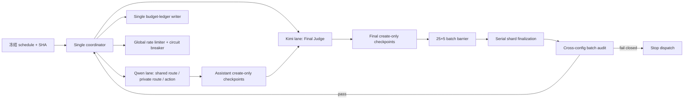

# Portfolio 200×5 / Core 1500×5 并行执行改造方案

日期：2026-08-05  
轨道：Portfolio Track  
状态：设计冻结候选；尚未启动新的付费主矩阵

## 1. 决策摘要

推荐把当前“按单配置 25-query shard 串行执行”改成“按 query 的五配置配对 wave 调度”，并建立彼此独立的 Qwen 与 Kimi provider lane：

- Qwen lane 负责 shared route、私有 route 和 Assistant action；
- Kimi lane 负责 Final Judge；
- 每个 query 的五个 Assistant 都完成后，才把该 query 的五个 Judge 按冻结顺序入队；
- S1+S2 与 Full 每个 query 只生成一次 shared route，并引用同一 create-only 工件；
- 预算账本、熔断器、限流器和任务所有权由单一 coordinator 全局管理；
- provider 工作并行，shard finalization 与 launch state 提交串行；
- 每完成一个 25×5 batch，暂停派发并完成跨配置审计，审计通过后才继续。

200×5 的建议冻结档位是聚合 `Qwen inflight=2 / Kimi inflight=4`。如果未计分并行 smoke 未通过，只降为 `2/2`，不在正式执行中升档。Core 的起始候选档位是 `Qwen=2 / Kimi=8`；必须在 core 解封前用未计分 smoke 验证并冻结，正式 core 内不试探更高并发。

这个方案保护的是请求、treatment、评分、配对关系和统计口径不变，并通过对称调度避免并发与 config 系统耦合。真实远程模型即使 temperature=0，也不能承诺串行和并行逐字节输出相同，因此不得把“无系统性调度偏置”写成“随机输出绝对不变”。

## 2. 当前状态与必须先修的缺陷

当前零调用基线是 `portfolio-dev-mini-200x5-launch-v27`，cap 为 CNY 200。它不能直接用于并发执行：

1. `PortfolioRatePolicy` 仍把 Assistant、Final Judge concurrency 冻结为 1。多进程各自显示 concurrency=1、但聚合并发大于 1，同样违反当前 launch contract。
2. 当前 matrix runner 完全串行，并在每个 shard 后立即 finalization。
3. 第 5 个 batch 的平面顺序是 `Full → NoSkill → Static → S1 → S1+S2`，但 Full 依赖同 batch 的 S1+S2 shared-route owner。按当前顺序执行会在 Full 处以 `shared_route_owner_incomplete` 停止。这是主矩阵启动前必须关闭的 P0。
4. 预算事件链允许 create-only 并发竞争，但每个 writer 发现其他写入后会重放账本，且竞争重试上限为 16。它不适合作为 core 数千次调用的多进程热写路径。
5. 当前 provider circuit breaker 是 shard 进程局部状态。直接开 N 个 worker 会把真实全局阈值从 2 次失败放大到最多 `N×2` 次。
6. finalizer 验证期间要求 ledger tail 不变，并会更新共享 `run-state.json`。它不能和 provider 调用或其他 finalizer 并行。

因此，v27 保留为零调用历史工件；代码、rate policy 和 scheduling policy 改完并验证后，生成新的 runtime lock 和零调用 launch，不原地篡改 v27。

## 3. 瓶颈与目标速度

最新 25×5 组合样本的五个 shard elapsed 合计约 4.32 小时。记录的远程耗时中，Kimi Final Judge 约 4.13 小时，Assistant 约 9 分钟；Judge 是决定性瓶颈，本地工具和文件 I/O 不是首要优化对象。

按现有实测线性外推：

| 范围 | 当前串行估计 | 推荐冻结档位 | 保守完成区间 |
|---|---:|---|---:|
| 200×5 | 约 34.5 小时 | Qwen 2 / Kimi 4 | 约 9–12 小时 |
| Core 1500×5 | 约 259 小时（10.8 天） | Qwen 2 / Kimi 8 | 约 36–42 小时 |
| Core stretch | 同上 | Qwen 2 / Kimi 12 | 约 25–30 小时 |

这些是基于 worker-hours 和 Judge 长尾的容量规划，不是 SLA。Core stretch 只有在 core 开始前的独立基础设施 smoke 通过时才可采用。

并行调度本身不增加 call identity、retry 或样本数，预期模型成本不变。按当前 25×5 实测，fresh 200×5 约 CNY 133.323；加上当前累计约 CNY 25.430，预计累计约 CNY 158.753。若增加一次未计分 25×5 live canary，预计累计约 CNY 175.418，仍低于已授权的 CNY 200，但实际账单仍受输出 token 和冻结重试触发影响。

Core 1500×5 的同尺度成本约 CNY 1,000，不在当前 CNY 200 授权内；执行 core 前应另行设置约 CNY 1,100 的阶段 cap 与硬预留余量。

## 4. 不得改变的实验不变量

并行化只改执行顺序和同时在途数量，不改以下内容：

- 6 个 capability、5 个主配置和 query 集合；
- query、图片、public input、Bank、treatment chain 和 shared-route 语义；
- provider、model、endpoint、temperature、top_p、token budget、tool budget 和 timeout；
- Assistant prompt、Final Judge prompt、rubric、parser、card guard、fixed-zero 和完整分母；
- 当前有界 retry 的资格条件和最大次数；
- S1+S2/Full 共用同一个 Stage-2 route 的要求；
- 每行请求只接受第一个合法响应，不按结果内容或分数择优；
- optimization25、evaluation175 与 all200 的分析边界。

此前针对 evidence DTO、回答长度、S2 confusion-pair、S3 aggregation 和 Pareto gate 的算法建议，不与本次并行化混改。它们若继续演进，必须形成另一份 treatment/runtime 和独立实验版本，避免把“算法变化”误归因于“执行加速”。

## 5. 推荐执行架构



### 5.1 工作单元与依赖 DAG

保留 25-query shard 作为落盘、审计和报告单元，但把运行粒度降为 row/stage：

```text
shared_route(query)
  ├─→ assistant(query, S1+S2)
  └─→ assistant(query, Full)

assistant(query, NoSkill / Static / S1)

all five assistant(query, config) complete
  └─→ five judge(query, config)

25 query waves complete
  └─→ quiesce providers
      └─→ finalize five shards serially
          └─→ audit 25×5 batch
```

每个五-query microblock 先完成五个 shared-route 节点，再释放该 microblock 的 25 个 Assistant 节点。这样 Full 不再因 launch 平面顺序抢跑，也不会让 S1+S2/Full 因 route readiness 与其他配置形成固定时间偏移。

Static/S1 的私有 route 仍由各自 Assistant task 按原 treatment 逻辑执行；NoSkill 不新增 route。全局 gate 包裹的是每一次真实 provider call，而不是只计算外层 task 数，因此多轮工具调用也受同一个聚合并发和 RPM/TPM 约束。

### 5.2 公平调度

启动前生成完整 schedule manifest 并写入 SHA，运行时不得重排：

- 五个 Assistant 使用一个 5×5 平衡 Latin/Williams 序列；
- 五个 Judge 使用另一个独立序列；
- 每连续五个 query，每个 config 在每个 dispatch position 恰好出现一次；
- query 顺序对五配置完全相同；
- 在 accepted batch、capability、`requires_card` 等既有层内，position count 的 max-min 不超过 1；
- 同一 query 的五个 Assistant 全部完成后才释放 Judge，禁止“Assistant 快的配置先进入 Judge 时间窗口”；
- 一个 batch 完成、finalize 和审计前，不推进下一 batch；
- 不允许根据中间 J、F1、错误样本或 latency 好坏改变顺序、并发或重试。

200 和 1500 都能被 5 整除，因此完整矩阵中每个 config 的位置暴露可以做到严格相等。运行时还要记录实际 start time、inflight 和 rolling RPM，验证计划平衡没有被线程调度破坏为实质性不平衡。

### 5.3 Provider lane

建议的 200 冻结 profile：

```text
aggregate_qwen_inflight = 2
aggregate_kimi_inflight = 4
qwen_dispatch_cap       = 40 RPM
feedback_inflight       = 0
max_active_query_waves  = 5
```

这里的 concurrency 是整个 execution root 的聚合上限，不是“每 worker 上限”。Qwen 保留低并发，是因为此前混合 shard 并行运行出现过 Qwen pre-response failures，而 Qwen 又不是主瓶颈；把并发主要给 Kimi 能获得大部分速度收益，同时降低 Assistant treatment 被基础设施故障不对称影响的风险。

Core 候选 profile：

```text
aggregate_qwen_inflight = 2
aggregate_kimi_inflight = 8
qwen_dispatch_cap       = 40 RPM
feedback_inflight       = 0
max_active_query_waves  = 10
```

RPM 和 TPM 使用两个 token bucket；拿到 provider permit 后才做预算 reservation，reservation 后立即发起调用，避免在队列中长期占用硬预算。完成后用实际 usage settle，再释放 permit。

正式运行中不做自动升档。基础设施异常只允许在完整 25×5 batch 边界降档；降档必须形成新的 `execution_epoch`，让五配置等量暴露，并在最终报告中做 epoch-stratified sensitivity。能不变更就优先停止、恢复同一 profile。

### 5.4 单写者预算账本与任务所有权

新增单一 ledger writer/broker：

- worker 向 broker 请求 reserve/settle；
- broker 继续写现有 canonical、create-only、hash-chained event 格式；
- provider 网络调用不持有账本锁；
- coordinator 启动时完整 replay 一次，之后在内存中推进已验证 prefix；
- finalization 仍独立完整 replay，不能依赖内存缓存作为最终证据。

每个 task 在调用前写 create-only claim。lease 只用于发现活跃 worker，不用于自动认定调用可安全重跑：

- claim 前崩溃：可以重新入队；
- claim 后但 ledger 无 reservation、checkpoint 也不存在：验证后可以重新入队；
- reservation 后进程崩溃：保留 unresolved reserve，fail closed，不因 lease 超时自动重复 provider call；
- settlement 后、checkpoint 前崩溃：走既有 orphan-call 诊断，不能悄悄再调用；
- Assistant checkpoint 已存在：只调度 Judge；
- Final checkpoint 已存在：严格验证后直接完成该 row。

### 5.5 全局熔断与重试

熔断器由 coordinator 按 `provider + stage` 全局维护：

- 首个 429 暂停对应 provider lane，并保存原始 attempt 事实；
- 连续两次 provider pre-response failure 打开对应 lane 的 circuit；
- circuit open 时不跳到另一 config 继续消耗请求；
- 不在 adapter 内新增自动 retry；
- 只保留当前冻结的 route-contract retry、Final-Judge empty/invalid-response retry 和已定义的 pre-response 恢复语义；
- 低分、tool error、parse error、响应内容异常均不是追加调用的理由；
- 若确认某次基础设施事故使一个 cell 失去比较资格，只能以新 run-id 对完整 `query×5 configs` paired wave 统一处理，不能选择性补一格。

## 6. 代码改造边界

| 文件/模块 | 改造内容 |
|---|---|
| `src/skillchain/evaluation/portfolio_launch.py` | 新版本 rate/scheduling policy；并发字段表示 aggregate；profile-aware 计数支持 200 与 1500 |
| `scripts/prepare_portfolio_launch.py` | 冻结 schedule manifest、provider profile、RPM/TPM、worker/wave 数及 SHA |
| `scripts/prepare_portfolio_execution.py` | execution control 绑定唯一 coordinator、schedule SHA 和并发 profile |
| 新增 `src/skillchain/evaluation/portfolio_scheduler.py` | 确定性 schedule、DAG、ready queue、barrier、execution epoch |
| `scripts/run_portfolio_shard.py` | 抽取可重入的 shared-route、Assistant row、Judge row 执行函数；保留旧串行 CLI 兼容路径 |
| `scripts/run_portfolio_matrix.py` | 单 coordinator；provider lanes；全局 gate/circuit；不再边执行边 finalize |
| `src/skillchain/evaluation/portfolio_execution.py` | ledger broker、task claim/journal、全局故障状态与恢复验证 |
| `scripts/finalize_portfolio_shard.py` | 分离 shard audit 生成与共享 run-state 提交 |
| 新增 `scripts/finalize_portfolio_matrix.py` | 单写者聚合 completion markers 并更新 run-state |
| `scripts/audit_portfolio_batch.py` | 校验 schedule、实际暴露、shared route、duplicate/orphan、selective retry |
| `scripts/analyze_portfolio_matrix.py` | profile-aware coverage；core 不沿用 mini 的 optimization25/evaluation175 标签 |

不新建通用分布式队列、数据库或外部调度服务。单机 coordinator + bounded thread workers 已足够覆盖本项目规模，也更容易保持 create-only 文件证据链。

## 7. 验证与灰度

### 阶段 A：零调用等价性

1. 同一 seed 重复生成 schedule，SHA 必须一致。
2. DAG task 集、call identity 集和依赖边必须与串行语义一致。
3. deterministic fake provider 下，串行与并行的规范化 wire request multiset、Assistant/Final checkpoint、shared-route count、分数、调用数和费用完全一致；允许 ledger event ordinal 因完成顺序不同而变化。
4. 注入随机 delay，以 2/4/8/16 worker 重复，不能出现重复成功、双写 shared route 或漏 row。
5. 在 reservation、provider response、settlement、Assistant checkpoint、Final checkpoint、summary 六个 crash window 注入故障并验证恢复。
6. fake clock 验证 aggregate inflight、RPM、TPM 和 circuit breaker，而不是每 worker 局部值。

### 阶段 B：未计分 live canary

用 optimization25 做一次不进入 primary evaluation 的 `Qwen=2/Kimi=4` infrastructure canary。并发档位只由以下条件决定，不查看 J/F1 来挑档：

- schedule SHA 无偏离；
- 125/125 row 完整；
- `duplicate_success=0`；
- `shared_route_artifact_count=25`，且 provider call 数只能是 25 加冻结规则实际触发的合法 route-contract retries；
- S1+S2/Full shared-route reference mismatch=0；
- ledger gap/busy/orphan/unresolved=0；
- selective retry=0；
- 无 aggregate inflight/RPM/TPM 越界；
- 各 config×stage dispatch position 完全平衡；
- config 间 start-time/epoch/concurrency 暴露差异的标准化差值目标 `|SMD|≤0.1`；
- 429 或 circuit-open 为 0；如未通过，冻结为 `2/2` 并重新做 canary，不在主矩阵中试错。

质量分数只作为 A/A 诊断，不作为接受并发 profile 的门，也不据此追加调用。

### 阶段 C：200×5 正式执行

1. 代码与 profile 冻结后 relock runtime；
2. 从 v27 的同一 query、Bank、runtime inputs、rubric 和 cap 派生新的零调用 launch；
3. dry-run 证明 40 shards / 1000 rows / 200 paired waves；
4. 每完成 25×5，quiesce、串行 finalize、跨配置 audit；
5. 八个 batch 全部通过后，单进程完成 matrix audit 与 analysis；
6. 正式结果只使用预注册的 evaluation175 primary scope，optimization25 继续是调参与基础设施证据。

### 阶段 D：Core 解封前

1. 把 profile 计数扩展到 1500 queries、7500 rows、60 batches、300 config shards；
2. 用 fake provider 做 7500-row 长程 ledger/scheduler stress；
3. 用未计分样本验证 `Qwen=2/Kimi=8`；
4. 只有在 core 启动前连续通过预声明基础设施门，才可选择 Kimi 12；
5. 冻结 core profile、schedule SHA、预算 cap 和 runtime 后再启动；正式 core 中不升档。

## 8. 每批停止条件

以下任一条件立即停止新派发并保留现场：

- query、Bank、runtime、request、rubric、model 或 schedule hash 漂移；
- 同一 call identity 出现多个成功响应或选择性保留响应；
- shared route 重复调用、缺失，或 S1+S2/Full reference 不一致；
- create-only artifact 冲突或已有 checkpoint 验证失败；
- ledger 超 cap、gap、busy、duplicate、orphan 或 unresolved 无法闭合；
- aggregate inflight、RPM、TPM 超过 launch contract；
- task 实际顺序偏离冻结 schedule；
- 一个 25×5 batch 未达到完整分母或跨配置 audit 出现 blocker。

Provider 级停止：首个 429 暂停该 lane；连续两次 pre-response 打开全局 circuit。绝不因为中间分数好坏提前停止，也不因某配置慢而让其余配置跨 batch 抢跑。

## 9. 完成判据

并行改造只有同时满足以下条件才可替代当前串行入口：

- deterministic serial-vs-parallel fixture 等价；
- 200 dry-run 的 1000 个 row task 与 launch instance 一一对应；
- core dry-run 的 7500 个 row task 与 300 个 shard 完整对应；
- 每 query 只有一个 create-only shared-route 工件及唯一 S1+S2 owner，S1+S2/Full 引用一致；冻结规则触发的 route-contract retry 必须单独留痕；
- 无重复成功、无选择性 retry、无未解释 orphan/unresolved；
- 五配置的 dispatch position 和时间/并发暴露达到预注册平衡门；
- finalizer 与活跃 ledger 严格隔离，run-state 不丢 shard；
- 现有 25×5 audit、分析和 card/evidence 契约回归全部通过；
- 新 launch 明确披露并发 profile，历史 v27 保持零调用不被改写。

## 10. 推荐实施顺序

1. 先版本化 rate/scheduling schema，加入 schedule generator 和 batch5 DAG 回归测试；
2. 抽取 row/stage executor，建立全局 provider gate、ledger broker 和 circuit breaker；
3. 实现 query-wave coordinator、batch barrier、串行 finalization 与恢复 journal；
4. 完成 deterministic/fault-injection/stress 测试；
5. 在 CNY 200 cap 内运行一次未计分 optimization25 canary；
6. profile 通过后 relock，并生成新的零调用 200×5 launch；
7. 完成 200×5 和求职成果后，再扩展 profile-aware core schema并申请 core 独立预算。

这一路径直接关闭当前 200×5 的 P0 调度依赖，并把对 core 真正有用的并行能力建立在同一执行器上，不需要先做一套一次性 shard pool、随后再推倒重写。
